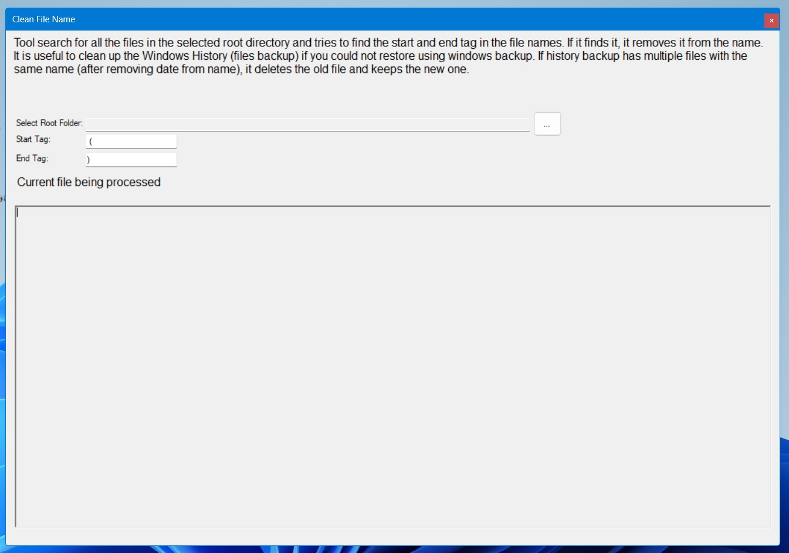

<h1>Cleans File Names in the Windows History Backup</h1>
  

&nbsp;

Windows backup file history at your configured location. There could be multiple version of the same file in format shown below:

<b>(File name)(2022_05_30 19_02_35 UTC).doc</b>

This tool goes through all the files in the selected root directory and removes <b> (TimeStamp)</b> part from the file name. It just renames the file.

Tool search for all the files in the selected root directory and tries to find the start <b>' ('</b> and end <b>')'</b> tags in the file name. If it finds it, it removes any text which is in between these tags including the tags from the file name. It is useful to clean up the Windows History (files backup) if you could not restore using windows backup (like me). If history backup has multiple files with the same name (after removing date from the name), it deletes the old file and keeps the new one (Compares Last Write Time).

If you need only the binary, it's in the <b>bin</b> folder. Otherwise, you can clone the repository and compile it yourself (C# project for .Net framework 4.8+). If you like, please modify or enhance the code. Use at your own risk, I take no responsibility.

